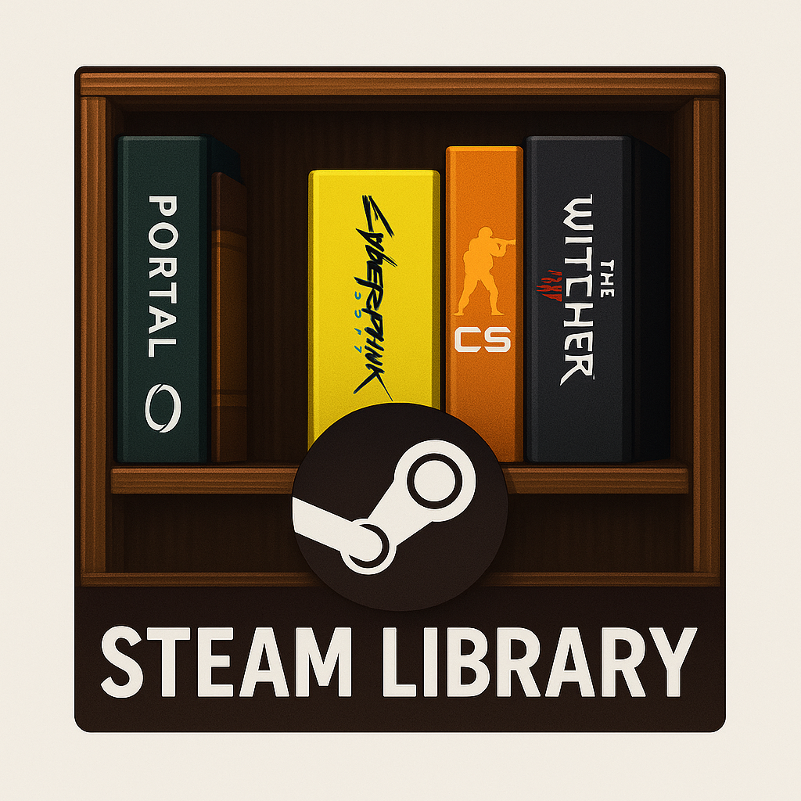

# Steam Library — система для трекинга и аналитики игр из Steam

## 🌟 Возможности
### ✅ Интеграция с Steam API
- Автоматическая синхронизация вашей библиотеки игр
- Отслеживание прогресса по достижениям
### ✅ Гибкий трекинг
- Отмечайте пройденные игры (100% ачивки или ручная пометка)
- История прохождения с датами
### ✅ Социальные функции
- Отзывы и комментарии к играм
- Советы по прохождению сложных моментов
### ✅ Аналитика
- Статистика по времени в играх
- Графики прогресса
### ✅ Продакшн-готовый стек
- Laravel 12 + React (Vite)
- PostgreSQL (с возможностью перехода на MySQL)
- DragonflyDB (улучшенный Redis)
- Nginx + PHP-FPM
- `docker-compose.yml` — как пример запуска **без Kubernetes**
## 🚀 Быстрый старт

### 1. Клонируй репозиторий

```bash
git clone https://github.com/SniffRx/steam-library.git  
cd steam-library
cp .env.example .env  # настройте Steam API ключи и БД
```

### 2. Сборка фронтенда
```bash
npm install && npm run build
```
> ⚠️ Этот шаг нужен, чтобы собрать React-фронт в public/build.

### 4. Запусти контейнеры

```bash
docker compose up -d --build  
docker compose exec app php artisan key:generate
```

## Так же можно использовать Makefile

### Как использовать:
- **make install** — установить npm-пакеты
- **make build** — собрать фронтенд (React)
- **make up** — собрать и запустить контейнеры в фоне
- **make down** — остановить и удалить контейнеры
- **make keygen** — сгенерировать Laravel APP_KEY
- **make migrate** — выполнить миграции базы
- **make logs** — смотреть логи Laravel-приложения в реальном времени

Лицензия: **MIT**

**Автор: [SniffRx](https://github.com/SniffRx/)**

> 💬 Есть идеи? Открывайте Issue или PR!
