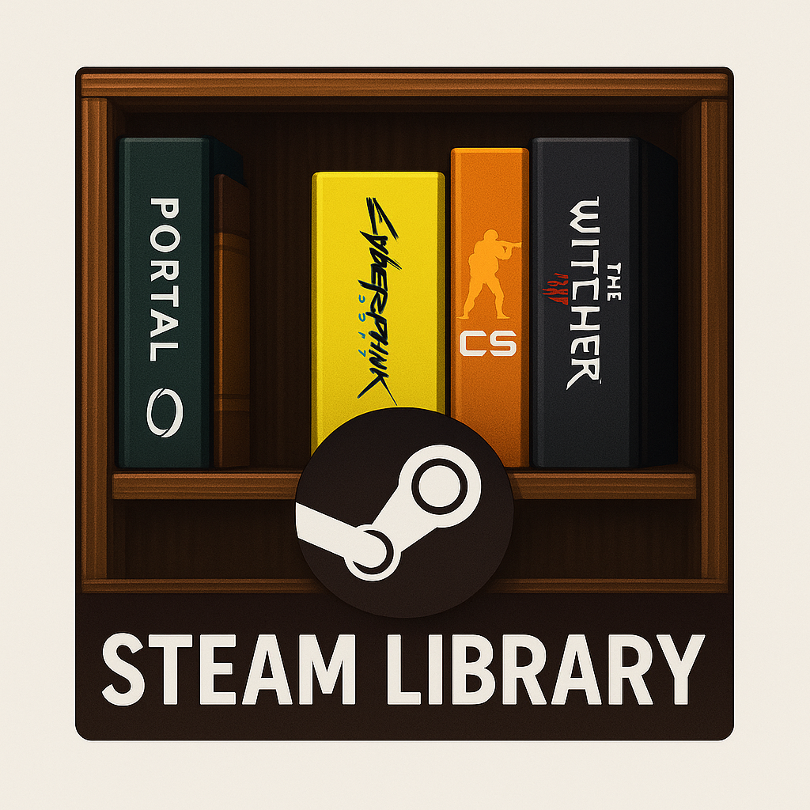
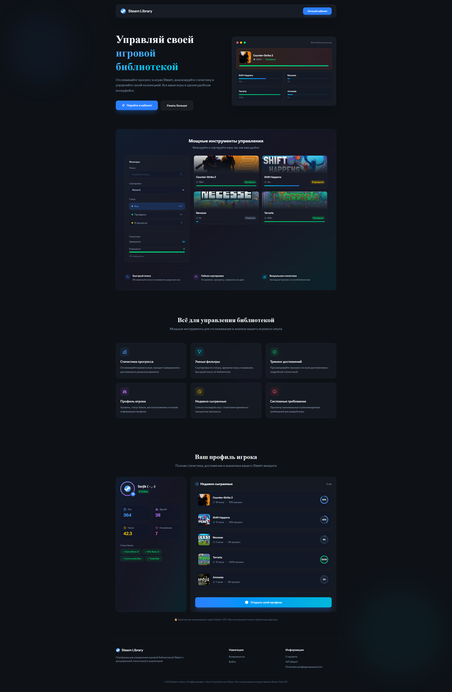
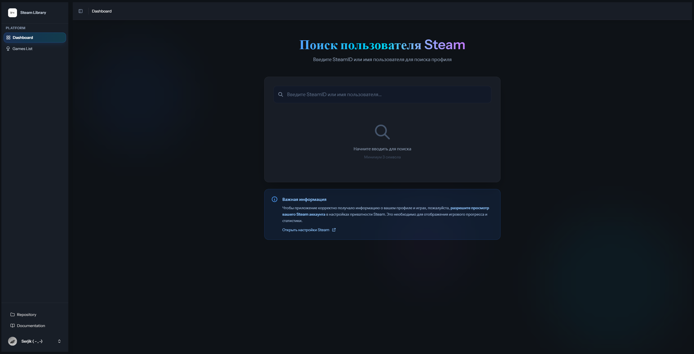
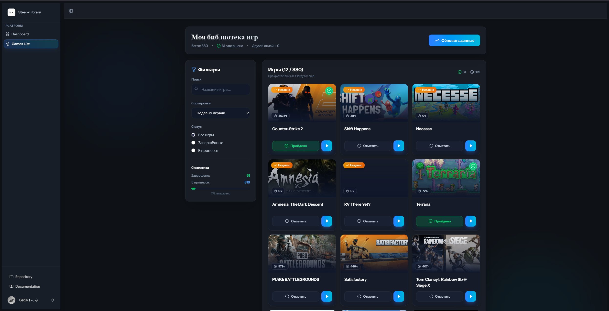
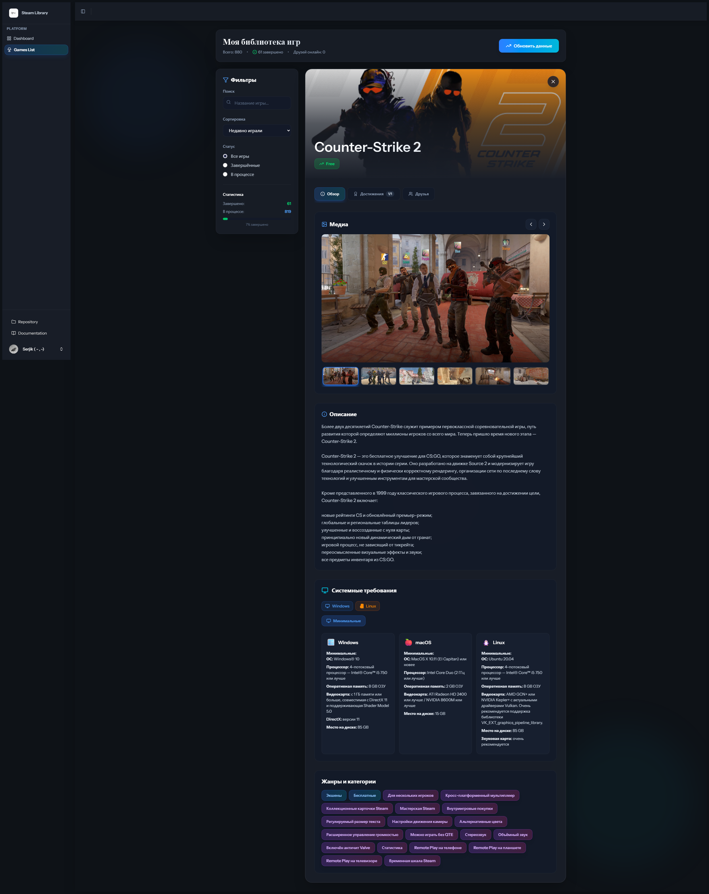
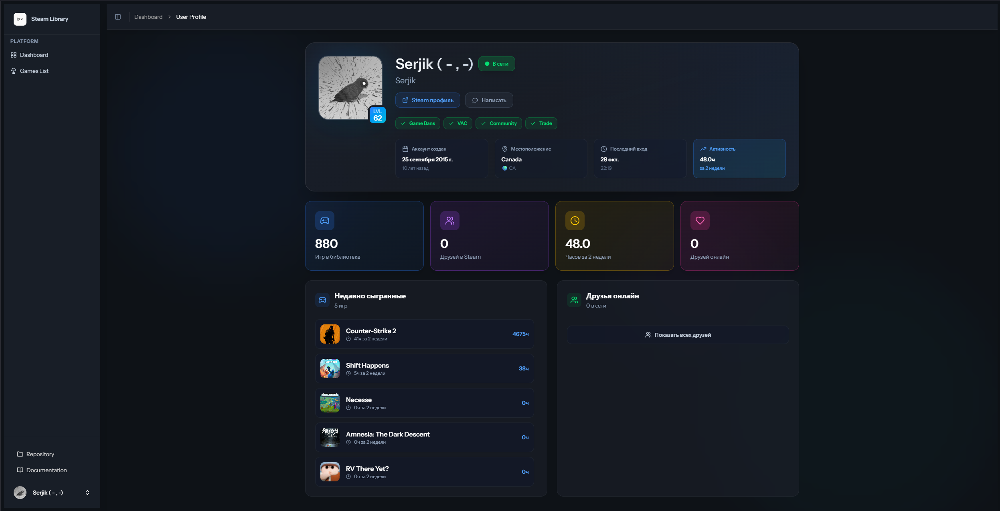

<div align="center">



# 🎮 Steam Library Tracker

### Твоя система для управления и анализа библиотеки Steam

[](https://www.typescriptlang.org/)
[](https://www.php.net/)
[](https://laravel.com/)
[](https://reactjs.org/)
[](LICENSE)

[Возможности](#-возможности) • [Быстрый старт](#-быстрый-старт) • [Технологии](#-технологический-стек) • [Скриншоты](#-скриншоты) • [Документация](#-документация)

</div>

---

## 🌟 Возможности

### 🔄 Steam API Integration
- **Автоматическая синхронизация** библиотеки игр каждые 24 часа
- **Отслеживание достижений** в реальном времени
- **Информация о друзьях** и их активности
- **Детальная статистика** по каждой игре

### ✅ Умный трекинг
- Автоматическая пометка игр с **100% достижениями**
- Ручное управление статусом прохождения
- История прогресса с датами и временем
- Фильтрация по статусу (пройдено/в процессе)

### 📊 Аналитика и статистика
- **Графики прогресса** по достижениям
- Статистика времени в играх
- Общий прогресс библиотеки
- Топ самых популярных игр

### 👥 Социальные функции
- Просмотр профилей друзей Steam
- Активность друзей в играх
- Список недавно сыгранных игр
- Steam Community интеграция

### 🎨 Современный UI/UX
- **Glassmorphism** дизайн
- Темная тема по умолчанию
- Адаптивный дизайн для всех устройств
- Плавные анимации (Framer Motion)
- Infinite scroll для больших библиотек

---

## 🚀 Быстрый старт

### Предварительные требования

- Docker & Docker Compose
- Node.js 20+ (для локальной сборки)
- Steam API Key ([получить здесь](https://steamcommunity.com/dev/apikey))

### 1️⃣ Клонирование репозитория

```sh 
git clone https://github.com/SniffRx/steam-library.git && cd steam-library
```

### 2️⃣ Настройка окружения
``` cp .env.example .env ```
Отредактируйте `.env` и добавьте ваши данные:
```env
APP_KEY=
DB_DATABASE=steam_library
DB_USERNAME=postgres
DB_PASSWORD=your_secure_password

#Steam API Configuration
STEAM_API_KEY=your_steam_api_key
```

### 3️⃣ Сборка frontend
``` npm install && npm run build```
> 💡 Это создаст production сборку React-приложения в `public/build/`

### 4️⃣ Запуск через Docker Compose
```bash
docker compose up -d --build
docker compose exec app php artisan key:generate
docker compose exec app php artisan migrate --force
docker compose exec app php artisan db:seed
```

### 5️⃣ Доступ к приложению

Откройте браузер: [**http://localhost:8080**](http://localhost:8080)

---

## 🛠 Технологический стек

### Backend
- **Laravel 12** — PHP framework
- **PostgreSQL 16** — основная база данных
- **DragonflyDB** — высокопроизводительный Redis-совместимый кэш
- **PHP 8.3-FPM** — обработка запросов
- **Nginx** — веб-сервер

### Frontend
- **React 19** — UI библиотека
- **TypeScript** — типизация
- **Vite 7** — сборщик
- **Tailwind CSS 4** — стилизация
- **Framer Motion** — анимации
- **Inertia.js** — SPA без API
- **React Query** — управление состоянием
- **Radix UI** — доступные компоненты

### DevOps
- **Docker** — контейнеризация
- **Supervisor** — управление процессами
- **GitHub Actions** — CI/CD (опционально)

---

## 📦 Makefile команды

Для удобства разработки используйте Makefile:

- make install # Установка npm-зависимостей
- make build # Сборка frontend (production)
- make dev # Запуск Vite dev server
- make up # Запуск Docker контейнеров
- make down # Остановка контейнеров
- make restart # Перезапуск контейнеров
- make keygen # Генерация APP_KEY
- make migrate # Выполнение миграций
- make seed # Заполнение тестовыми данными
- make fresh # Пересоздание БД с миграциями
- make logs # Просмотр логов приложения
- make shell # Вход в контейнер приложения
- make clean # Очистка кэша и временных файлов

---

## 🖼 Скриншоты

### Главная страница


### Страница поиска


### Библиотека игр


### Детали игры


### Профиль пользователя


---

## 📁 Структура проекта

```
steam-library/
├── app/ # Laravel application
│ ├── Http/
│ ├── Models/
│ └── Services/
├── resources/
│ ├── js/ # React application
│ │ ├── components/ # Переиспользуемые компоненты
│ │ ├── layouts/ # Layout компоненты
│ │ ├── pages/ # Страницы (Inertia)
│ │ └── hooks/ # Custom React hooks
│ └── css/ # Стили
├── docker/ # Docker конфигурация
│ ├── nginx/
│ └── prod/
├── public/ # Публичная директория
│ └── build/ # Собранный frontend
└── docker-compose.yml # Docker Compose конфигурация
```

---

## 🔧 Разработка

### Локальная разработка

### Terminal 1 - Vite dev server
```npm run dev```

### Terminal 2 - Laravel application
```docker compose up```

### Terminal 3 - Queue worker (опционально)
```docker compose exec app php artisan queue:work```

### Code Quality

### TypeScript проверка
```npm run types```

### ESLint
```npm run lint```

### Prettier
```npm run format```

### PHP CS Fixer (если установлен)
```./vendor/bin/pint```

---

## 🌐 API Endpoints

### Основные маршруты

- `GET /` — Welcome page
- `GET /dashboard` — Главная панель
- `GET /gameslist` — Библиотека игр
- `GET /steam/user/{steamId}` — Профиль пользователя
- `POST /gameslist/sync-all` — Синхронизация с Steam

### Steam Integration

Приложение использует официальный **Steam Web API**:
- GetOwnedGames
- GetPlayerAchievements
- GetFriendList
- GetPlayerSummaries
- GetUserStatsForGame

---

## 🐳 Production Deployment

### Docker multi-stage build

Проект использует оптимизированный multi-stage Dockerfile:

1. **Frontend stage** — сборка React приложения
2. **Backend stage** — финальный образ с PHP-FPM + Nginx

### Сборка production образа
```sh
docker build -t steam-library:latest -f docker/prod/Dockerfile .
```

### Запуск
```sh
docker compose -f docker-compose.yml up -d
```

---

## 🔐 Безопасность

- ✅ CSRF защита
- ✅ XSS защита
- ✅ SQL Injection защита (Eloquent ORM)
- ✅ Rate Limiting
- ✅ Session management
- ✅ Secure password hashing

---

## 🤝 Вклад в проект

Мы приветствуем вклад сообщества! Вот как вы можете помочь:

1. Fork репозитория
2. Создайте feature branch (`git checkout -b feature/AmazingFeature`)
3. Commit изменения (`git commit -m 'Add some AmazingFeature'`)
4. Push в branch (`git push origin feature/AmazingFeature`)
5. Откройте Pull Request

---

## 📝 Roadmap

- [ ] Экспорт данных в CSV/JSON
- [ ] Система рекомендаций игр
- [ ] GraphQL API

#### В размышлениях
- Поддержка множественных Steam аккаунтов ?
- Интеграция с другими платформами (Epic Games, GOG) ?
- Mobile приложение (React Native) ?
- Telegram bot для уведомлений ?


---

## 📄 Лицензия

Этот проект лицензирован под **MIT License** - подробности в файле [LICENSE](LICENSE).

---

## 👨‍💻 Автор

**SniffRx**

- GitHub: [@SniffRx](https://github.com/SniffRx)
- Telegram: [SniffRxIT](https://t.me/t.me/sniffrxit) *(Посты по программированию и помощь новичкам)*
- Telegram: [SerjikSGR](https://t.me/serjiksgr) *(Канал с видосами по играм и LIVE контент)*

---

## 💬 Поддержка

Есть вопросы или предложения?

- 🐛 [Сообщить об ошибке](https://github.com/SniffRx/steam-library/issues/new?template=bug_report.md)
- 💡 [Предложить функцию](https://github.com/SniffRx/steam-library/issues/new?template=feature_request.md)
- 💬 [Обсуждения](https://github.com/SniffRx/steam-library/discussions)

---

## ⭐ Star History

[](https://star-history.com/#SniffRx/steam-library&Date)

---

<div align="center">

**Если проект был полезен — поставьте ⭐️**

Made with ❤️ by [SniffRx](https://github.com/SniffRx)

</div>
